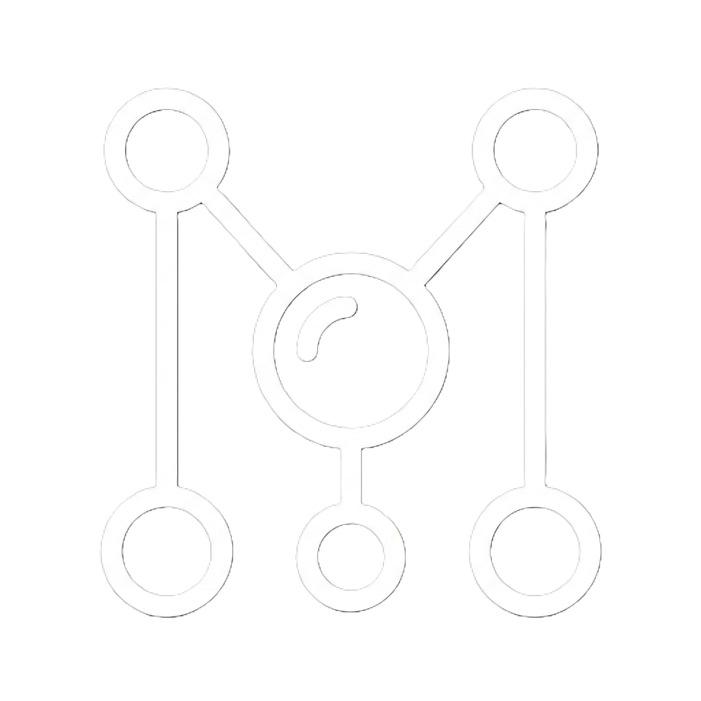

#  PROJECT MOLECUL 

## Deskripsi

Project Molecul adalah aplikasi berbasis **Enterprise Monorepo** yang mengusung teknologi *Cross-Platform* (React Native/Expo) untuk *client* dan Laravel untuk sistem *backend*. Aplikasi ini dibuat khusus untuk menjadi pendamping komprehensif bagi pemain Mobile Legends: Bang Bang, menyediakan *database* hero lengkap, pusat info turnamen e-sports, hingga sistem prediksi pertandingan (*betting*) berhadiah poin.

### Arsitektur Proyek
Repositori ini dibagi menjadi dua bagian utama yang sangat rapi:
- **`api/` (Backend)**: Sistem server yang dibangun dengan Laravel 10 dan MySQL. Mengelola autentikasi pengguna (Sanctum), data profil pengguna, saldo koin, sistem prediksi skor, dan kontrol Dasbor Admin.
- **`client/` (Frontend)**: Aplikasi *Cross-Platform* yang dibangun dengan React Native dan Expo.

### Fitur Utama
- **Sistem Autentikasi & Koin**: Sistem *login*, pendaftaran, dan manajemen saldo koin pengguna yang terpusat.
- **Prediksi Pertandingan**: Pengguna dapat bertaruh poin pada tim e-sports jagoan mereka di pertandingan dunia nyata maupun *Dummy Match*.
- **Dasbor Admin Interaktif**: Antarmuka khusus untuk admin dalam me-*resolve* pemenang pertandingan, membuat simulasi *dummy match*, dan mengelola koin seluruh pengguna secara *in-app* dan *real-time*.
- **Database Hero**: Mengambil data hero, atribut, dan *role* secara *real-time* dari server eksternal [](https://github.com/ridwaanhall/api-mobilelegends).
- **Portal E-Sports Terintegrasi**: Terhubung ke PandaScore API untuk menarik jadwal pertandingan profesional, *live score*, dan klasemen turnamen MLBB global.

## Cara Menjalankan Aplikasi

Pastikan Anda sudah menginstal **PHP, Composer, MySQL, Node.js, dan npm** di sistem Anda.

### 1. Menjalankan Backend (API Laravel)
```bash
cd api
composer install
cp .env.example .env # Atur DB_DATABASE, DB_USERNAME, DB_PASSWORD di sini
php artisan key:generate
php artisan migrate
php artisan serve
```

### 2. Menjalankan Frontend (Client Expo)
Buka tab terminal baru (biarkan server Laravel tetap menyala):
```bash
cd client
npm install
npx expo start -c
```
Untuk mengetes aplikasi, Anda dapat memindai *QR code* yang muncul menggunakan aplikasi **Expo Go** di HP fisik Anda. Alternatif lain, tekan tombol `a` di terminal untuk membuka lewat Emulator Android, atau tekan `i` untuk Simulator iOS.

## Konfigurasi Token PandaScore

Supaya jadwal e-sports dan klasemen turnamen bisa muncul, diperlukan token API dari PandaScore.
1. Buat akun gratis terlebih dahulu di https://pandascore.co/
2. Masuk ke halaman *dashboard* mereka untuk membuat API Token baru.
3. Kembali ke proyek ini, lalu buka file `client/src/services/config.js`.
4. Masukkan token milik Anda:

```javascript
// client/src/services/config.js
export const PANDASCORE_TOKEN = 'MASUKKAN_TOKEN_DISINI';
```

Jika token belum diisi, aplikasi **tidak akan crash**. Tampilan E-Sports hanya akan terlihat kosong dan sistem akan mencetak peringatan ringan di konsol.
